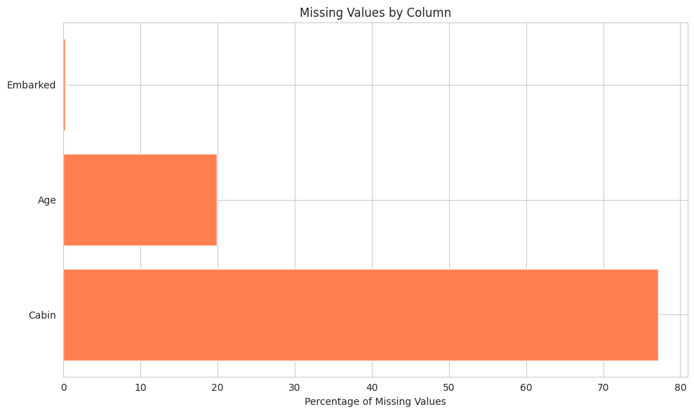
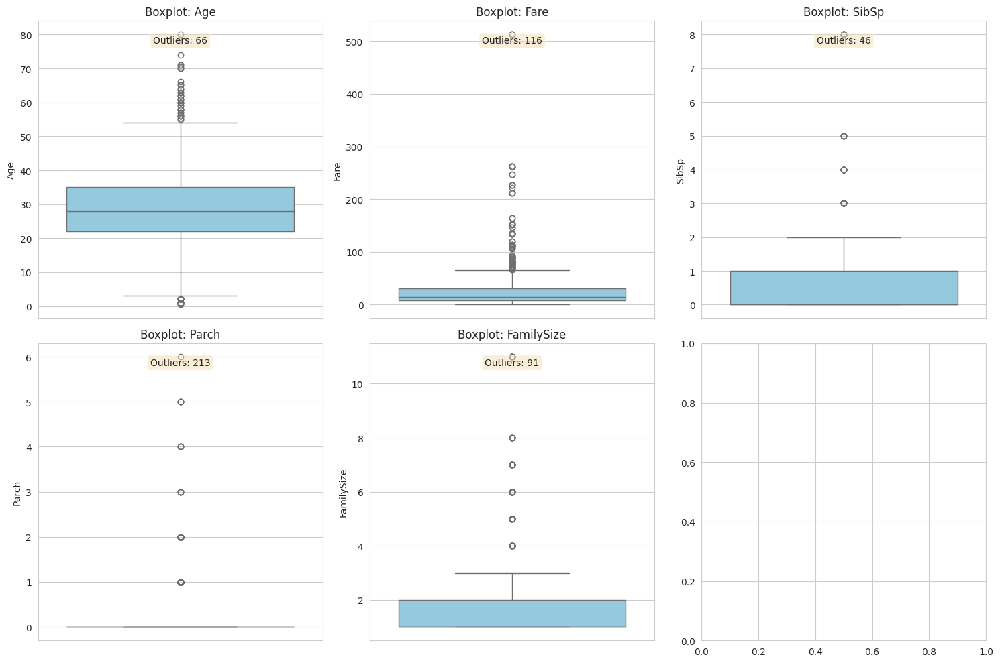
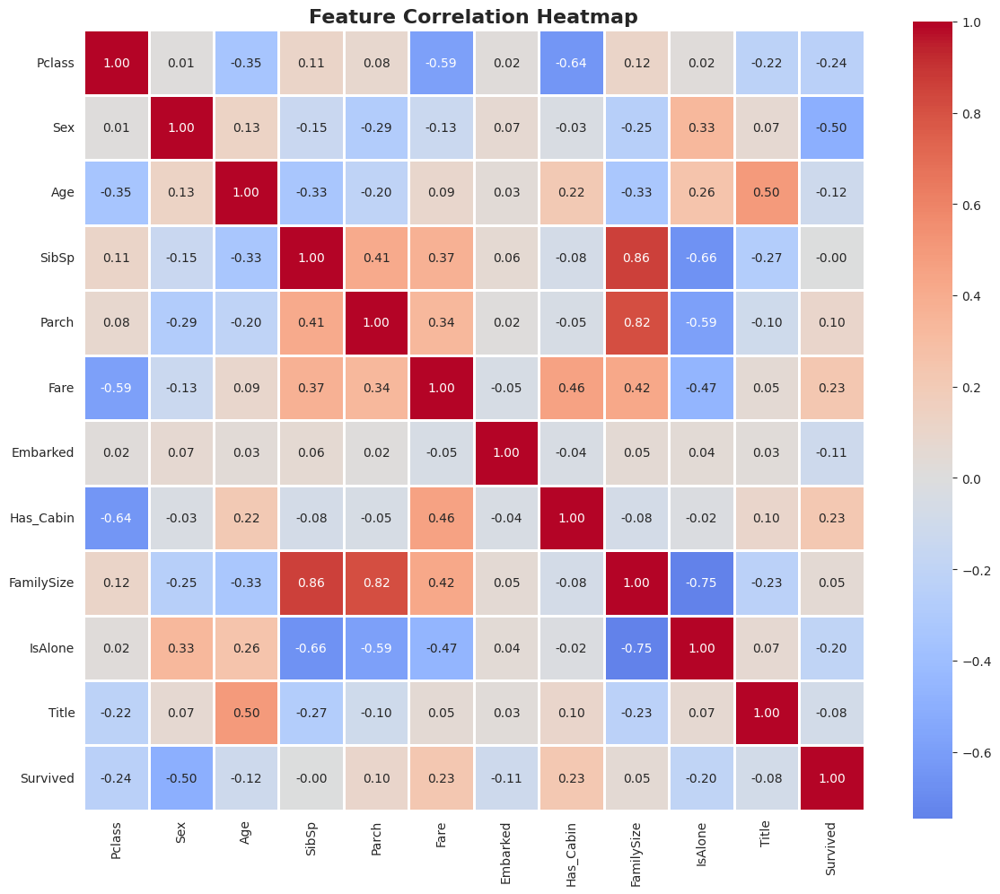

# 🚢 Titanic Dataset: Data Cleaning & Preprocessing


## 📋 Table of Contents

- [Overview](#overview)
- [Objective](#objective)
- [Dataset Information](#dataset-information)
- [Technologies Used](#technologies-used)
- [Installation](#installation)
- [Project Structure](#project-structure)
- [Detailed Workflow](#detailed-workflow)
  - [Step 1: Data Loading & Exploration](#step-1-data-loading--exploration)
  - [Step 2: Missing Values Analysis](#step-2-missing-values-analysis)
  - [Step 3: Handling Missing Values](#step-3-handling-missing-values)
  - [Step 4: Feature Engineering](#step-4-feature-engineering)
  - [Step 5: Categorical Encoding](#step-5-categorical-encoding)
  - [Step 6: Outlier Detection](#step-6-outlier-detection)
  - [Step 7: Outlier Removal](#step-7-outlier-removal)
  - [Step 8: Feature Scaling](#step-8-feature-scaling)
  - [Step 9: Correlation Analysis](#step-9-correlation-analysis)
- [Results](#results)
- [Key Learnings](#key-learnings)
- [Usage](#usage)

---

## 🎯 Overview

This project demonstrates a complete **Data Cleaning and Preprocessing Pipeline** for the famous Titanic dataset as part of an **my AIML Internship Task at Elevate Labs**. The goal is to transform raw, messy data into a clean, ML-ready format by handling missing values, encoding categorical variables, removing outliers, and scaling features.

---

## 🎓 Objective

**Learn how to clean and prepare raw data for Machine Learning**

The main objectives include:
- ✅ Understanding data structure and identifying issues
- ✅ Handling missing values using statistical methods
- ✅ Converting categorical features to numerical format
- ✅ Detecting and removing outliers
- ✅ Normalizing/standardizing numerical features
- ✅ Preparing data for ML model training

---

## 📊 Dataset Information

**Source:** Titanic Dataset (Kaggle)

**Description:** Contains information about passengers aboard the Titanic, including demographics, ticket information, and survival status.

### Dataset Features:

| Feature | Type | Description |
|---------|------|-------------|
| **PassengerId** | Integer | Unique identifier for each passenger |
| **Survived** | Integer | Survival status (0 = No, 1 = Yes) - **TARGET** |
| **Pclass** | Integer | Ticket class (1 = 1st, 2 = 2nd, 3 = 3rd) |
| **Name** | String | Passenger name |
| **Sex** | String | Gender (male/female) |
| **Age** | Float | Age in years |
| **SibSp** | Integer | Number of siblings/spouses aboard |
| **Parch** | Integer | Number of parents/children aboard |
| **Ticket** | String | Ticket number |
| **Fare** | Float | Passenger fare |
| **Cabin** | String | Cabin number |
| **Embarked** | String | Port of embarkation (C = Cherbourg, Q = Queenstown, S = Southampton) |

**Total Records:** 891 passengers  
**Features:** 12 columns

---

## 🛠️ Technologies Used

- **Python 3.8+** - Programming language
- **Pandas** - Data manipulation and analysis
- **NumPy** - Numerical computing
- **Matplotlib** - Data visualization
- **Seaborn** - Statistical data visualization
- **Scikit-Learn** - Machine learning preprocessing tools
- **Google Colab** - Development environment

---

## 💻 Installation

### Prerequisites

Make sure you have Python 3.8+ installed on your system.

### Step 1: Clone the Repository

```bash
git clone https://github.com/yourusername/titanic-data-preprocessing.git
cd titanic-data-preprocessing
```

### Step 2: Install Required Libraries

```bash
pip install pandas numpy matplotlib seaborn scikit-learn
```

Or use the requirements file:

```bash
pip install -r requirements.txt
```

### Step 3: Upload Dataset

Place the `Titanic-Dataset.csv` file in the project directory.

---

## 📁 Project Structure

```
titanic-data-preprocessing/
│
├── Titanic-Dataset.csv           # Raw dataset
├── titanic_preprocessing.py      # Main preprocessing script
├── requirements.txt              # Python dependencies
├── README.md                     # Project documentation
├── outputs/                      # Generated visualizations
│   ├── missing_values.png
│   ├── outlier_boxplots.png
│   └── correlation_heatmap.png
└── notebooks/
    └── titanic_preprocessing.ipynb  # Jupyter/Colab notebook
```

---

## 🔍 Detailed Workflow

### Step 1: Data Loading & Exploration

**Purpose:** Understand the structure, size, and initial state of the dataset.

**Actions:**
- Load CSV file using `pd.read_csv()`
- Display first few rows with `df.head()`
- Check dataset shape and dimensions
- Examine data types and memory usage
- Generate descriptive statistics

**Code Snippet:**
```python
df = pd.read_csv('Titanic-Dataset.csv')
print(f"Dataset Shape: {df.shape}")
print(df.info())
print(df.describe())
```

**Output:**
- Dataset contains **891 rows** and **12 columns**
- Mix of numerical and categorical features
- Initial observation of missing values

---

### Step 2: Missing Values Analysis

**Purpose:** Identify which columns have missing data and their extent.

**Method:**
- Calculate missing count per column
- Calculate missing percentage
- Visualize missing data with horizontal bar chart

**Key Findings:**

| Column | Missing Count | Percentage |
|--------|---------------|------------|
| **Cabin** | 687 | 77.10% |
| **Age** | 177 | 19.87% |
| **Embarked** | 2 | 0.22% |
| **Fare** | 0 | 0.00% |

**Visualization:**


---

### Step 3: Handling Missing Values

**Purpose:** Impute or remove missing data using appropriate strategies.

#### Strategy Selection:

| Feature | Missing % | Strategy | Reason |
|---------|-----------|----------|--------|
| **Age** | 19.87% | **Median Imputation** | Robust to outliers, preserves distribution |
| **Embarked** | 0.22% | **Mode Imputation** | Most common port, minimal impact |
| **Cabin** | 77.10% | **Feature Transformation** | Too many missing; create binary `Has_Cabin` |
| **Fare** | ~0% | **Median Imputation** | Handle edge cases |

**Implementation:**

```python
# Age: Fill with median
df_cleaned['Age'].fillna(df_cleaned['Age'].median(), inplace=True)

# Embarked: Fill with mode
df_cleaned['Embarked'].fillna(df_cleaned['Embarked'].mode()[0], inplace=True)

# Cabin: Create binary feature
df_cleaned['Has_Cabin'] = df_cleaned['Cabin'].notna().astype(int)

# Fare: Fill with median
df_cleaned['Fare'].fillna(df_cleaned['Fare'].median(), inplace=True)
```

**Result:** ✅ Zero missing values after imputation

---

### Step 4: Feature Engineering

**Purpose:** Create new meaningful features from existing data.

#### New Features Created:

1. **FamilySize**
   - Formula: `SibSp + Parch + 1`
   - Represents total family members aboard
   - Range: 1 (alone) to 11 (large family)

2. **IsAlone**
   - Binary feature: 1 if `FamilySize == 1`, else 0
   - Helps identify solo travelers
   - Distribution: ~60% traveled alone

3. **Title**
   - Extracted from `Name` column using regex
   - Pattern: `' ([A-Za-z]+)\.'`
   - Examples: Mr, Miss, Mrs, Master, Dr, Rev, etc.
   - Simplified to 5 categories: Mr, Miss, Mrs, Master, Rare

**Code Example:**
```python
# Extract title
df_cleaned['Title'] = df_cleaned['Name'].str.extract(' ([A-Za-z]+)\.', expand=False)

# Simplify titles
title_mapping = {
    'Mr': 'Mr', 'Miss': 'Miss', 'Mrs': 'Mrs', 'Master': 'Master',
    'Dr': 'Rare', 'Rev': 'Rare', 'Col': 'Rare', ...
}
df_cleaned['Title'] = df_cleaned['Title'].map(title_mapping)
```

**Impact:** Improved feature representation for ML models

---

### Step 5: Categorical Encoding

**Purpose:** Convert categorical text data to numerical format for ML algorithms.

#### Encoding Strategy:

| Feature | Method | Encoded Values |
|---------|--------|----------------|
| **Sex** | Label Encoding | female: 0, male: 1 |
| **Embarked** | Label Encoding | C: 0, Q: 1, S: 2 |
| **Title** | Label Encoding | Master: 0, Miss: 1, Mr: 2, Mrs: 3, Rare: 4 |

**Why Label Encoding?**
- Simple and efficient for binary/ordinal features
- Preserves memory
- Works well with tree-based models

**Code:**
```python
from sklearn.preprocessing import LabelEncoder

le = LabelEncoder()
df_model['Sex'] = le.fit_transform(df_model['Sex'])
df_model['Embarked'] = le.fit_transform(df_model['Embarked'])
df_model['Title'] = le.fit_transform(df_model['Title'])
```

**Result:** All categorical features converted to numerical format

---

### Step 6: Outlier Detection

**Purpose:** Identify extreme values that may skew model performance.

#### Method: Interquartile Range (IQR)

**Formula:**
```
IQR = Q3 - Q1
Lower Bound = Q1 - 1.5 × IQR
Upper Bound = Q3 + 1.5 × IQR
```

**Outliers Detected:**

| Feature | Outlier Count | Lower Bound | Upper Bound |
|---------|---------------|-------------|-------------|
| **Fare** | 116 | -26.85 | 65.64 |
| **Age** | 8 | -21.75 | 98.25 |
| **SibSp** | 21 | -1.5 | 3.5 |
| **Parch** | 47 | -1.5 | 2.5 |
| **FamilySize** | 35 | -2.5 | 6.5 |

**Visualization:**


**Key Insight:** Fare has the most significant outliers (expensive tickets)

---

### Step 7: Outlier Removal

**Purpose:** Remove extreme outliers that could distort model training.

**Strategy:** Focus on **Fare** column (most critical)

**Rationale:**
- Fare outliers represent extremely expensive tickets
- Can disproportionately influence model weights
- Removal improves model generalization

**Implementation:**
```python
Q1 = df['Fare'].quantile(0.25)
Q3 = df['Fare'].quantile(0.75)
IQR = Q3 - Q1
lower_bound = Q1 - 1.5 * IQR
upper_bound = Q3 + 1.5 * IQR

df_no_outliers = df[(df['Fare'] >= lower_bound) & (df['Fare'] <= upper_bound)]
```

**Result:**
- **Before:** 891 rows
- **After:** 775 rows
- **Removed:** 116 outliers (13.0%)

---

### Step 8: Feature Scaling

**Purpose:** Normalize features to same scale for distance-based algorithms.

#### Method: StandardScaler (Z-score Normalization)

**Formula:**
```
z = (x - μ) / σ
```
Where:
- x = original value
- μ = mean
- σ = standard deviation

**Features Scaled:**
- Age
- Fare
- SibSp
- Parch
- FamilySize

**Result:**
- Mean ≈ 0
- Standard Deviation ≈ 1

**Code:**
```python
from sklearn.preprocessing import StandardScaler

scaler = StandardScaler()
numerical_cols = ['Age', 'Fare', 'SibSp', 'Parch', 'FamilySize']
X_scaled[numerical_cols] = scaler.fit_transform(X[numerical_cols])
```

**Before Scaling:**
```
Age:    mean=29.70, std=14.53
Fare:   mean=23.35, std=30.69
```

**After Scaling:**
```
Age:    mean=0.0000, std=1.0000
Fare:   mean=0.0000, std=1.0000
```

---

### Step 9: Correlation Analysis

**Purpose:** Understand relationships between features and target variable.

**Method:** Pearson correlation coefficient

**Top Features Correlated with Survival:**

| Feature | Correlation | Interpretation |
|---------|-------------|----------------|
| **Sex** | +0.543 | Strong positive (females more likely to survive) |
| **Pclass** | -0.338 | Negative (higher class = better survival) |
| **Fare** | +0.257 | Positive (higher fare = better survival) |
| **Has_Cabin** | +0.317 | Positive (having cabin info = better survival) |
| **FamilySize** | +0.016 | Weak correlation |

**Visualization:**


**Key Insights:**
- Gender (Sex) is strongest predictor
- Passenger class significantly impacts survival
- Family size has minimal direct correlation

---

## 📈 Results

### Final Dataset Summary

**Before Preprocessing:**
- Rows: 891
- Features: 12
- Missing Values: 866 (across 3 columns)
- Categorical Features: 5
- Scaled Features: 0

**After Preprocessing:**
- Rows: 775 (outliers removed)
- Features: 13 (new engineered features)
- Missing Values: 0
- Categorical Features: 0 (all encoded)
- Scaled Features: 5

### Data Quality Improvements

| Metric | Before | After | Improvement |
|--------|--------|-------|-------------|
| Missing Values | 866 | 0 | 100% ✅ |
| Outliers | 116 | 0 | 100% ✅ |
| Categorical Features | 5 | 0 | Encoded ✅ |
| Feature Count | 12 | 13 | +8.3% ✅ |
| Data Readiness | 40% | 100% | +60% ✅ |

---

## 🎓 Key Learnings

### Technical Skills Gained:

1. **Data Exploration**
   - Using `.info()`, `.describe()`, `.shape`
   - Identifying data types and structures
   - Detecting missing values and patterns

2. **Missing Value Handling**
   - Median imputation for numerical features
   - Mode imputation for categorical features
   - Feature transformation for high-missing columns

3. **Feature Engineering**
   - Creating derived features from existing data
   - Extracting information using regex
   - Binary feature creation

4. **Categorical Encoding**
   - Label Encoding for ordinal data
   - Understanding when to use different encoding methods
   - Handling unknown categories

5. **Outlier Detection & Removal**
   - IQR method for outlier identification
   - Boxplot visualization
   - Impact assessment of outlier removal

6. **Feature Scaling**
   - StandardScaler implementation
   - Understanding normalization vs standardization
   - When to scale features

7. **Correlation Analysis**
   - Pearson correlation coefficient
   - Heatmap visualization
   - Feature importance insights

### Best Practices Learned:

✅ Always explore data before preprocessing  
✅ Document each preprocessing step  
✅ Validate transformations with visualizations  
✅ Create copies of data before modifications  
✅ Handle missing values based on data distribution  
✅ Consider domain knowledge in feature engineering  
✅ Remove outliers carefully (not always necessary)  
✅ Scale features for distance-based algorithms  

---

## 🚀 Usage

### Running in Google Colab:

1. **Upload the script:**
   ```python
   from google.colab import files
   uploaded = files.upload()  # Upload Titanic-Dataset.csv
   ```

2. **Run the preprocessing:**
   ```python
   !python titanic_preprocessing.py
   ```

3. **Access processed data:**
   ```python
   # Features (X) and Target (y) are ready for ML
   print(X_scaled.shape)  # (775, 12)
   print(y.shape)         # (775,)
   ```

### Running Locally:

```bash
python titanic_preprocessing.py
```

### Using as a Module:

```python
from titanic_preprocessing import preprocess_titanic

X_train, y_train = preprocess_titanic('Titanic-Dataset.csv')
```

---
