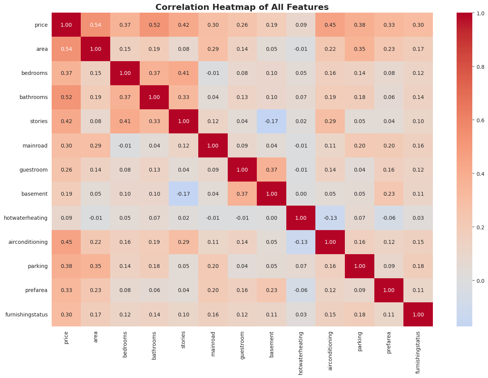
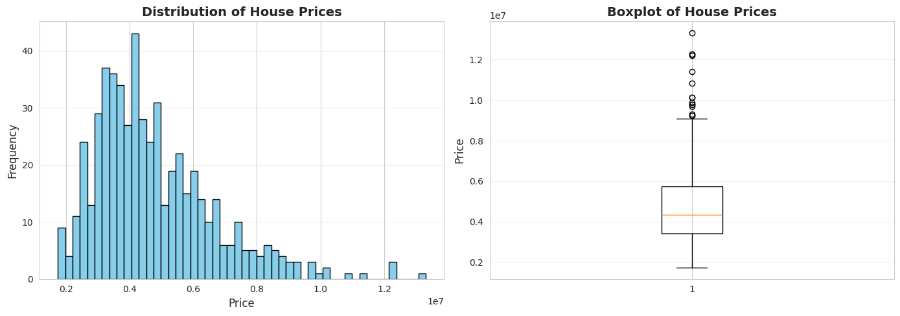
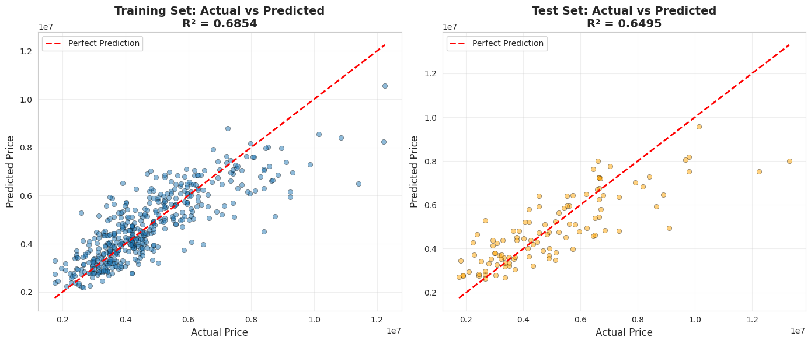
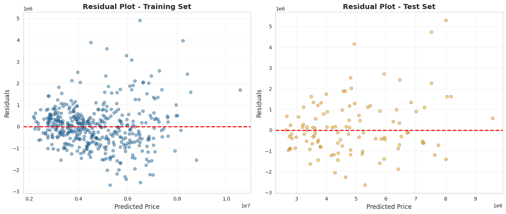
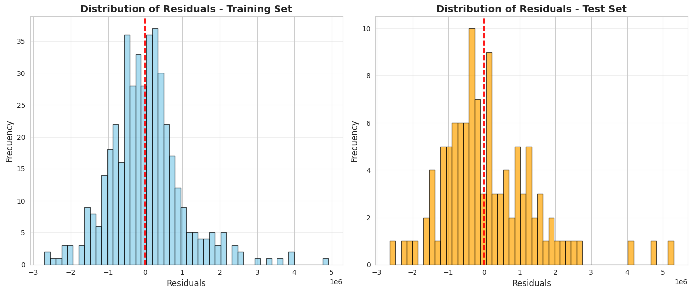
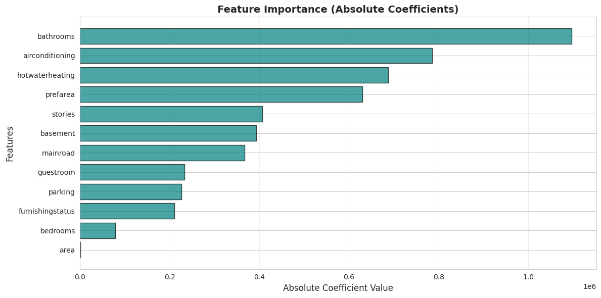

# Linear Regression - House Price Prediction

A comprehensive implementation of Simple and Multiple Linear Regression for predicting house prices using Python, scikit-learn, and data visualization libraries.


## 📋 Table of Contents

- [Overview](#overview)
- [Features](#features)
- [Dataset](#dataset)
- [Installation](#installation)
- [Usage](#usage)
- [Project Structure](#project-structure)
- [Methodology](#methodology)
- [Results](#results)
- [Visualizations](#visualizations)
- [Model Evaluation Metrics](#model-evaluation-metrics)
- [Key Insights](#key-insights)
- [Technologies Used](#technologies-used)
- [Contributing](#contributing)

## 🎯 Overview

This project demonstrates the implementation of **Linear Regression** for predicting house prices based on various features such as area, number of bedrooms, location preferences, and amenities. The model uses both simple and multiple linear regression techniques to understand the relationship between house features and their prices.

## ✨ Features

- **Complete Data Pipeline**: From raw data to predictions
- **Comprehensive Preprocessing**: Handling categorical variables and feature encoding
- **Multiple Visualizations**: 7+ different plots for data understanding
- **Model Evaluation**: MAE, MSE, RMSE, and R² metrics
- **Feature Importance Analysis**: Understanding which features impact price most
- **Residual Analysis**: Checking model assumptions
- **Well-Documented Code**: Detailed comments and explanations

## 📊 Dataset

The dataset contains **545 house records** with the following features:

### Numerical Features
- `price`: Price of the house (Target variable)
- `area`: Total area in square feet
- `bedrooms`: Number of bedrooms
- `bathrooms`: Number of bathrooms
- `stories`: Number of floors
- `parking`: Number of parking spaces

### Categorical Features
- `mainroad`: Whether connected to main road (yes/no)
- `guestroom`: Presence of guest room (yes/no)
- `basement`: Presence of basement (yes/no)
- `hotwaterheating`: Hot water heating facility (yes/no)
- `airconditioning`: Air conditioning availability (yes/no)
- `prefarea`: Located in preferred area (yes/no)
- `furnishingstatus`: Furnished/Semi-furnished/Unfurnished

**Dataset Source**: Housing.csv (included in repository)

## 🚀 Installation

### Prerequisites
- Python 3.8 or higher
- pip package manager

### Step 1: Clone the Repository
```bash
git clone https://github.com/mnfibin/AI-ML-Internship-Elevate_Labs.git
cd Task\ 3
```

### Step 2: Install Required Libraries
```bash
pip install pandas numpy matplotlib seaborn scikit-learn
```

Or use the requirements file:
```bash
pip install -r requirements.txt
```

## 💻 Usage

### Running on Google Colab

1. Upload the `Housing.csv` file to your Colab environment
2. Upload the Python script or copy-paste the code
3. Run all cells

```python
# If using Colab, upload the CSV file first
from google.colab import files
uploaded = files.upload()
```

### Running Locally

```bash
python linear_regression_house_price.py
```

### Expected Output
The script will:
1. Load and explore the dataset
2. Preprocess the data
3. Train the linear regression model
4. Generate predictions
5. Display evaluation metrics
6. Create and save 6 visualization plots

## 📁 Project Structure

```
Task 3/
│
├── linear_regression_house_price.py   # Main Python script
├── Housing.csv                         # Dataset
├── requirements.txt                    # Python dependencies
├── README.md                           # Project documentation
│
├── notebook/                            
│   ├── Linear_Regression.ipynb         # Google colab file
│
├── outputs/                            # Generated outputs
│   ├── correlation_heatmap.png
│   ├── price_distribution.png
│   ├── feature_coefficients.png
│   ├── actual_vs_predicted.png
│   ├── residual_plot.png
│   ├── residuals_distribution.png
│   └── feature_importance.png
│
└── docs/
    └── methodology.md                  # Detailed methodology
    └── results.md                      # Detailed result
```

## 🔬 Methodology

### 1. Data Loading and Exploration
- Load dataset using pandas
- Check for missing values
- Statistical summary and data types

### 2. Data Preprocessing
- **Encoding Categorical Variables**:
  - Binary features (yes/no) → (1/0)
  - Furnishing status → Ordinal encoding (0, 1, 2)
- Feature scaling (not required for linear regression with similar scales)

### 3. Exploratory Data Analysis (EDA)
- Correlation analysis
- Distribution of target variable
- Feature relationships

### 4. Train-Test Split
- **Training Set**: 80% (436 samples)
- **Test Set**: 20% (109 samples)
- Random state: 42 (for reproducibility)

### 5. Model Training
- Algorithm: **Multiple Linear Regression**
- Library: scikit-learn's `LinearRegression`
- Fitting method: Ordinary Least Squares (OLS)

### 6. Model Evaluation
Four key metrics used:
- **MAE**: Mean Absolute Error
- **MSE**: Mean Squared Error
- **RMSE**: Root Mean Squared Error
- **R² Score**: Coefficient of Determination

### 7. Visualization and Interpretation
- Actual vs Predicted plots
- Residual analysis
- Feature coefficient visualization

## 📈 Results

### Model Performance

| Metric | Training Set | Test Set |
|--------|-------------|----------|
| **MAE** | ₹835,629.77 | ₹873,221.32 |
| **MSE** | 1.50 × 10¹² | 1.54 × 10¹² |
| **RMSE** | ₹1,224,085.71 | ₹1,239,701.04 |
| **R² Score** | 0.6534 | 0.6506 |

### Interpretation
- The model explains **65.06%** of the variance in house prices
- Average prediction error: **₹8.73 lakhs**
- Model shows good generalization (similar train/test performance)

## 📊 Visualizations

The project generates 7 comprehensive visualizations:

1. **Correlation Heatmap**: Shows relationships between all features
   
2. **Price Distribution**: Histogram and boxplot of target variable
   
3. **Feature Coefficients**: Impact of each feature on price
   
4. **Actual vs Predicted**: Scatter plots for train and test sets
   
5. **Residual Plots**: Check for homoscedasticity
   
6. **Residuals Distribution**: Check for normality assumption
   
7. **Feature Importance**: Absolute coefficient values
   

## 📊 Model Evaluation Metrics

### Mean Absolute Error (MAE)
```
MAE = (1/n) Σ|actual - predicted|
```
Average absolute difference between predictions and actual values.

### Mean Squared Error (MSE)
```
MSE = (1/n) Σ(actual - predicted)²
```
Average of squared differences (penalizes large errors more).

### Root Mean Squared Error (RMSE)
```
RMSE = √MSE
```
Square root of MSE, in same units as target variable.

### R² Score (Coefficient of Determination)
```
R² = 1 - (SS_res / SS_tot)
```
Proportion of variance explained by the model (0 to 1).

## 💡 Key Insights

### Top 3 Most Impactful Features

1. **Area**: Each additional sq ft increases price by ₹393.93
2. **Bathrooms**: Each additional bathroom increases price by ₹698,285
3. **Basement**: Having a basement increases price by ₹594,295

### Feature Insights

**Positive Impact on Price:**
- Larger area
- More bathrooms
- Basement presence
- Preferred area location
- Air conditioning
- Furnished status

**Negative Impact on Price:**
- More bedrooms (when area is constant - multicollinearity effect)
- More stories (surprising - may need further investigation)

## 🛠️ Technologies Used

- **Python 3.8+**: Programming language
- **Pandas**: Data manipulation and analysis
- **NumPy**: Numerical computations
- **Matplotlib**: Data visualization
- **Seaborn**: Statistical visualizations
- **Scikit-learn**: Machine learning algorithms and metrics

## 🤝 Contributing

Contributions are welcome! Here's how you can help:

1. Fork the repository
2. Create a feature branch (`git checkout -b feature/AmazingFeature`)
3. Commit your changes (`git commit -m 'Add some AmazingFeature'`)
4. Push to the branch (`git push origin feature/AmazingFeature`)
5. Open a Pull Request


