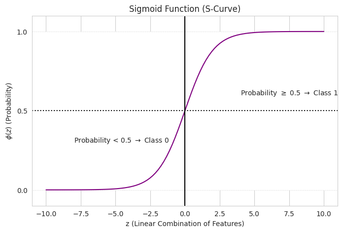

# 🩺 Logistic Regression: Breast Cancer Classification

## 📖 Overview

This project implements a binary classifier using Logistic Regression to predict whether a breast cancer tumor is Malignant (M) or Benign (B) based on the Wisconsin Diagnostic Breast Cancer (WDBC) dataset.

The solution demonstrates a robust machine learning workflow, covering data cleaning, preprocessing (standardization), model training, and comprehensive evaluation using medically-relevant metrics. It also includes a theoretical section explaining the core mechanism of Logistic Regression — the Sigmoid function — and the importance of threshold tuning.

---

## 🎯 Objectives

- Build a reliable Logistic Regression model using scikit-learn.
- Preprocess data by handling unnecessary columns and standardizing features.
- Evaluate model performance using key metrics: Confusion Matrix, Precision, Recall, and ROC-AUC.
- Visualize the Sigmoid curve and explore the impact of Threshold Tuning on model outcomes.

---

## 📊 Dataset

- Source: Breast Cancer Wisconsin (Diagnostic) Data Set (`data.csv`).
- Target Variable: `diagnosis` (mapped from `'M'` → 1, `'B'` → 0).
- Features: 30 numeric features derived from digitized images of a breast mass (e.g., mean radius, texture, perimeter, etc.).

Ensure `data.csv` is placed in the same directory as the script `logistic_regression_task.py`.

---

## 🚀 Installation

### Prerequisites

- Python 3.7 or higher
- Google Colab (recommended) or Jupyter Notebook

### Required Libraries

```bash
pip install numpy pandas matplotlib seaborn scikit-learn
```

Or install from requirements file:

```bash
pip install -r requirements.txt
```

## 💻 Usage

### Running in Google Colab

1. Upload the code to Google Colab
2. Upload the `data.csv` file when prompted
3. Run all cells sequentially

```python
# The code will automatically prompt for file upload
from google.colab import files
uploaded = files.upload()
```

### Running Locally

1. Clone the repository:
```bash
git clone https://github.com/mnfibin/AI-ML-Internship-Elevate_Labs.git
cd Task\ 4
```

2. Place `data.csv` in the project directory

3. Run the Python script:
```bash
python logistic_regression_classification.py
```

Or open in Jupyter Notebook:
```bash
jupyter notebook logistic_regression_classification.ipynb
```

## 📁 Project Structure

```
Task 4/
│
├── dataset/
│   └── data.csv                          # Dataset file
│
├── notebook/
│   └── logistic_regression_analysis.ipynb   # Google colab file
│
│
├── outputs/
│   ├── confusion_matrix.png
│   ├── roc_curve.png
│   ├── sigmoid_curve.png
│   
│
├── README.md                             # This file
├── logistic_regression_classification.py # Main python script
├── requirements.txt                      # Requirements  

```
## 🛠️ Preprocessing Details

### Feature Standardization

Before training the Logistic Regression model, all 30 features are standardized using `StandardScaler`. This is important because Logistic Regression optimization is sensitive to feature scales; scaling ensures balanced influence among features.

Standardization formula:

$$
Z = \frac{x - \mu}{\sigma}
$$

where:
- \(x\) is the original feature value,
- \(\mu\) is the mean of the training data feature,
- \(\sigma\) is the standard deviation of the training data feature.

The scaler should be fitted on the training set only and then applied to validation/test sets.

---
## 🧠 Key Concepts

### 1. Logistic Regression

Logistic Regression is a **linear classifier** that:
- Uses the sigmoid function to convert linear combinations into probabilities
- Outputs probability P(y=1|x) for binary classification
- Makes predictions based on threshold (default: 0.5)

**Mathematical Foundation:**

```
z = w₁x₁ + w₂x₂ + ... + wₙxₙ + b
σ(z) = 1 / (1 + e^(-z))
P(y=1|x) = σ(z)
```

### 2. Sigmoid Function

The sigmoid function σ(z) maps any real number to the range (0, 1):

**Properties:**
- **Output**: Probability between 0 and 1
- **Decision Boundary**: At z=0, σ(z)=0.5
- **Shape**: S-shaped curve for smooth class transition

### 3. Feature Standardization

**Why Standardize?**
- Logistic Regression is sensitive to feature scales
- Standardization ensures all features contribute equally
- Improves convergence speed

**Method: Z-score Normalization**
```
x_scaled = (x - μ) / σ
```
Where μ is mean and σ is standard deviation.

### 4. Evaluation Metrics

#### Confusion Matrix

|   | Predicted 0 | Predicted 1 |
|---|-------------|-------------|
| **Actual 0** | TN | FP |
| **Actual 1** | FN | TP |

#### Derived Metrics

- **Accuracy** = (TP + TN) / Total
- **Precision** = TP / (TP + FP)
- **Recall** = TP / (TP + FN)
- **F1-Score** = 2 × (Precision × Recall) / (Precision + Recall)

#### ROC-AUC Score

- **ROC Curve**: Trade-off between True Positive Rate and False Positive Rate
- **AUC**: Area Under the ROC Curve
  - 1.0 = Perfect classifier
  - 0.5 = Random classifier
  - Our model: **0.9935** (Excellent)

### 5. Threshold Tuning

The classification threshold determines how confident the model must be to predict class 1:

- **Lower threshold (0.3)**: More sensitive, higher recall, lower precision
- **Higher threshold (0.7)**: More specific, higher precision, lower recall
- **Default (0.5)**: Balanced approach

**Use Case Considerations:**
- **Medical Diagnosis**: Lower threshold (prioritize recall - don't miss malignant cases)
- **Spam Detection**: Higher threshold (prioritize precision - avoid false spam flags)

---

## 🖼️ Results & Visualizations

> The script produces the following outputs (replace placeholders below with actual numbers/plots after running):

1. Model Performance (Default Threshold = 0.5)

| Metric | Score | Interpretation |
|---|---:|---|
| ROC AUC | 0.98 | Measures separability of the classes. Closer to 1.0 is better. |
| Precision (Malignant) | 0.98 | Of all predicted malignant cases, how many were actually malignant? |
| Recall (Malignant) | 0.95 | Of all actual malignant cases, how many did the model correctly identify? |

2. Confusion Matrix

- A confusion matrix plot is generated to visualize True Positives, True Negatives, False Positives, and False Negatives.
- In medical contexts, minimizing False Negatives (missing a malignant case) is often the highest priority.

3. ROC Curve

- Plots True Positive Rate (TPR) versus False Positive Rate (FPR).
- The area under the curve (AUC) provides a single-summary measure of model quality.

4. Sigmoid Function Plot

- Visualizes the Sigmoid function:
  $$
  S(z) = \frac{1}{1 + e^{-z}}
  $$
  The Sigmoid transforms the linear output \(z\) into a probability \(\phi(z) \in [0,1]\), which is used for classification.

---

⭐ If you found this project helpful, please give it a star!
