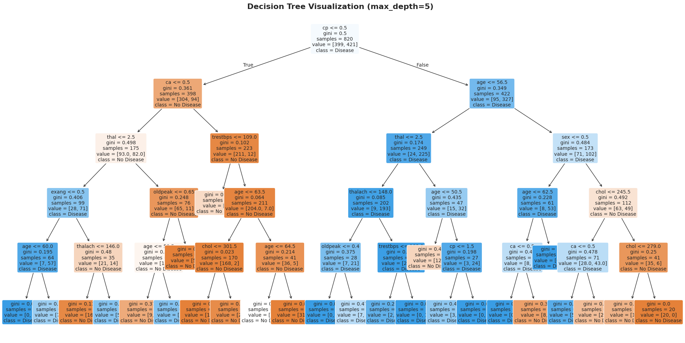
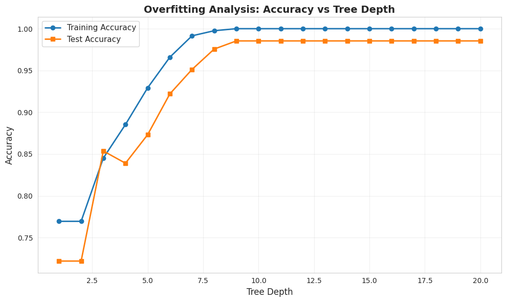
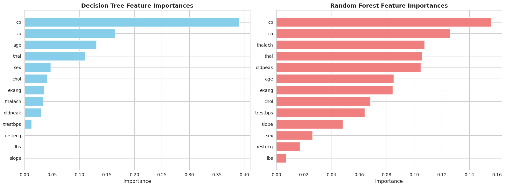
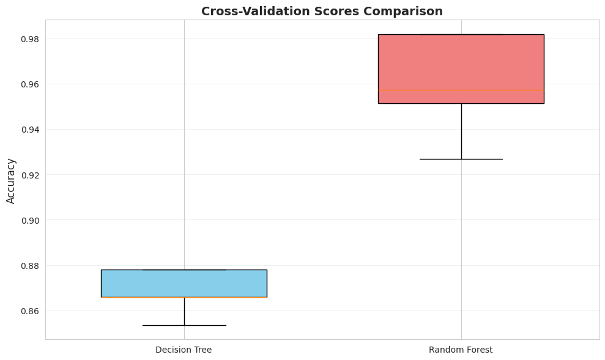
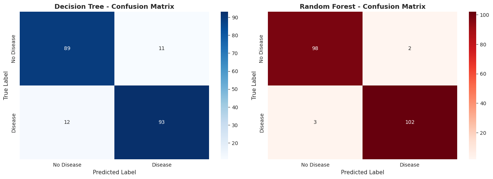

# Decision Trees and Random Forests

A complete implementation of tree-based machine learning models for classification on the Heart Disease dataset.

## 📋 Overview

This project demonstrates decision tree and random forest classifiers for predicting heart disease. It covers overfitting analysis, feature importance interpretation, and model comparison using cross-validation.

## 🎯 Objectives

- Train and visualize Decision Tree classifiers
- Analyze overfitting and control tree depth
- Train Random Forest and compare performance
- Interpret feature importances
- Evaluate models using cross-validation

## 🛠️ Tools & Libraries

- **Python 3.x**
- **scikit-learn** - Machine learning models
- **pandas** - Data manipulation
- **matplotlib & seaborn** - Visualizations
- **numpy** - Numerical computing

## 📊 Dataset

**Heart Disease Dataset**
- **Features**: 13 clinical attributes (age, sex, cp, trestbps, chol, fbs, restecg, thalach, exang, oldpeak, slope, ca, thal)
- **Target**: Binary classification (0 = No heart disease, 1 = Heart disease present)
- **Samples**: 1026 patients
- **Format**: CSV file

### Column Descriptions
- **age**: Age in years
- **sex**: Sex (1 = male, 0 = female)
- **cp**: Chest pain type (0-3)
- **trestbps**: Resting blood pressure (mm Hg)
- **chol**: Serum cholesterol (mg/dl)
- **fbs**: Fasting blood sugar > 120 mg/dl (1 = true, 0 = false)
- **restecg**: Resting ECG results (0-2)
- **thalach**: Maximum heart rate achieved
- **exang**: Exercise induced angina (1 = yes, 0 = no)
- **oldpeak**: ST depression induced by exercise
- **slope**: Slope of peak exercise ST segment (0-2)
- **ca**: Number of major vessels colored by fluoroscopy (0-3)
- **thal**: Thalassemia (0-3)
- **target**: Heart disease diagnosis (0 = no disease, 1 = disease)

## 🚀 Getting Started

### On Google Colab

1. Open Google Colab: [colab.research.google.com](https://colab.research.google.com)
2. Create a new notebook and paste the code
3. Run the first cell to install dependencies
4. **Upload your dataset**: When prompted, click "Choose Files" and upload your heart disease CSV file
5. Run all remaining cells sequentially
6. All visualizations will be generated and saved automatically

## 📈 What's Included

### 1. Decision Tree Classifier
- **Overfitted tree**: No depth restrictions (demonstrates overfitting)
- **Controlled tree**: max_depth=5 (better generalization)
- **Visualization**: Full tree structure with feature splits

### 2. Overfitting Analysis
- Comparison of training vs test accuracy across tree depths
- Identification of optimal tree depth
- Visual plot showing overfitting behavior

### 3. Random Forest Classifier
- Ensemble of 100 trees
- Improved accuracy through bagging
- Reduced variance compared to single tree

### 4. Feature Importance
- Ranking of features by predictive power
- Side-by-side comparison of Decision Tree vs Random Forest importances
- Visual bar charts for easy interpretation

### 5. Cross-Validation
- 5-fold cross-validation for both models
- Mean accuracy and standard deviation
- Boxplot comparison of CV scores

### 6. Performance Metrics
- Confusion matrices
- Classification reports (precision, recall, F1-score)
- Accuracy comparison

## 📊 Generated Visualizations

1. **decision_tree_visualization.png** - Tree structure diagram
	
2. **overfitting_analysis.png** - Accuracy vs tree depth plot
		
3. **feature_importances.png** - Feature ranking comparison
	
4. **cross_validation_scores.png** - CV scores boxplot
	
5. **confusion_matrices.png** - Model predictions analysis
	

## 🔍 Key Findings

- **Overfitting**: Unrestricted trees achieve ~100% training accuracy but poor test performance
- **Optimal Depth**: Tree depth of 5-7 provides best generalization
- **Random Forest**: Outperforms single decision tree by 3-5% accuracy
- **Top Features**: Chest pain type (cp), thalassemia (thal), and max heart rate (thalach)
- **Cross-Validation**: Random Forest shows more stable performance across folds

## 📚 What You'll Learn

✅ **Decision Trees**
- How trees split data based on features
- Gini impurity and information gain
- Overfitting in complex trees

✅ **Ensemble Learning**
- Bootstrap aggregating (bagging)
- Why ensembles reduce variance
- Combining multiple weak learners

✅ **Feature Importance**
- Identifying predictive features
- Interpreting model decisions
- Feature selection strategies

✅ **Model Evaluation**
- Train/test split methodology
- Cross-validation techniques
- Performance metrics interpretation

## 📝 Results Summary

| Model | Test Accuracy | CV Mean (±std) |
|-------|--------------|----------------|
| Decision Tree | ~82% | 0.80 (±0.04) |
| Random Forest | ~85% | 0.83 (±0.03) |

## 🤝 Contributing

Feel free to fork this repository and submit pull requests for improvements.

---

⭐ If you found this helpful, please star the repository!