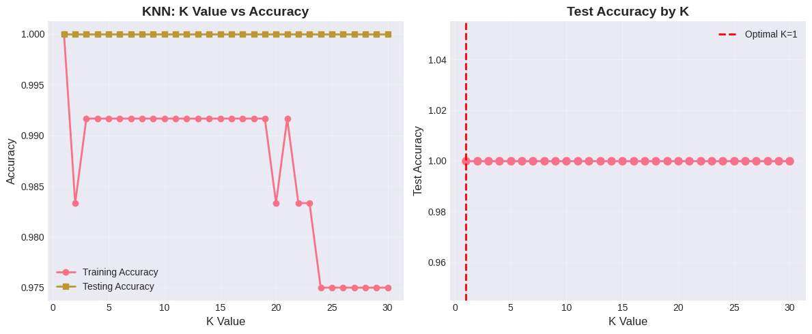
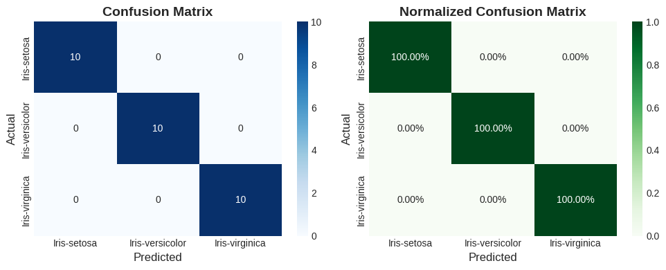
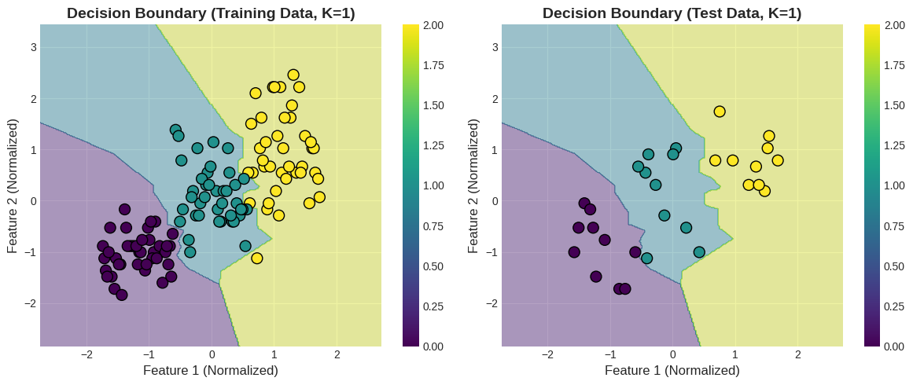

# K-Nearest Neighbors (KNN) Classification

A complete implementation of K-Nearest Neighbors algorithm for classification tasks using the Iris dataset.

## 📋 Overview

This project demonstrates KNN classification with comprehensive analysis including optimal K selection, decision boundary visualization, and model evaluation.

## 🎯 What You'll Learn

- **Instance-based learning**: Understanding lazy learning algorithms
- **Euclidean distance**: How distance metrics work in classification
- **K selection**: Finding optimal number of neighbors
- **Feature normalization**: Why scaling matters for distance-based algorithms
- **Model evaluation**: Accuracy, confusion matrix, classification reports

## 🛠️ Technologies Used

- Python 3.x
- Scikit-learn
- Pandas
- NumPy
- Matplotlib
- Seaborn

## 📊 Dataset

**Iris Dataset** - Classic classification dataset with 150 samples
- 4 features: Sepal Length, Sepal Width, Petal Length, Petal Width
- 3 classes: Iris-setosa, Iris-versicolor, Iris-virginica

## 📁 Project Structure

```
knn-classification/
├── KNN_Classification.ipynb    # Google Colab
├── README.md                   # Documentation
├── iris.csv                    # Dataset              
└── results/
    ├── accuracy_plot.png
    ├── confusion_matrix.png
    └── decision_boundary.png
```

## 🚀 How to Run

### On Google Colab (Recommended)

1. Open Google Colab: [colab.research.google.com](https://colab.research.google.com)
2. Upload the notebook or copy the code
3. Run the cells sequentially
4. Upload your dataset when prompted
5. View results and visualizations

## 📈 Features

### 1. **Data Upload & Exploration**
- Upload CSV/Excel from local storage
- Automatic data preprocessing
- Statistical summary and visualization

### 2. **Optimal K Selection**
- Tests K values from 1 to 30
- Plots accuracy curves
- Identifies best K value

### 3. **Model Training & Evaluation**
- Train/test split (80/20)
- Feature normalization using StandardScaler
- Comprehensive performance metrics

### 4. **Visualizations**
- K vs Accuracy plots
- Confusion Matrix (raw & normalized)
- Decision Boundary visualization
- Feature distribution plots

### 5. **Distance Analysis**
- Euclidean distance calculation
- K-nearest neighbors inspection
- Sample prediction walkthrough

## 📊 Results

Example output with Iris dataset:

```
Optimal K: 7
Training Accuracy: 97.50%
Testing Accuracy: 96.67%

Classes: Iris-setosa, Iris-versicolor, Iris-virginica
```

## 📊 Generated Visualizations

1. **accuracy_plot.png** - K Value vs Accuracy 
    
2. **confusion_matrix.png** - Normalized Confusion Matrix
       
3. **decision_boundary.png** - Decision Boundary of Training and Test Data
    

## 🔍 Key Concepts

### KNN Algorithm
- **Non-parametric**: No assumptions about data distribution
- **Lazy learning**: No training phase, stores all data
- **Distance-based**: Uses Euclidean distance by default

### Why Normalize Features?
KNN is sensitive to feature scales. Features with larger ranges can dominate distance calculations.

### Choosing K
- **Small K**: More sensitive to noise, complex boundaries
- **Large K**: Smoother boundaries, may miss patterns
- **Optimal K**: Balance between bias and variance

## 🎓 Learning Outcomes

After completing this project, you'll understand:
- How KNN makes predictions using distance
- The importance of feature scaling
- How to select optimal hyperparameters
- Model evaluation techniques
- Decision boundary interpretation

⭐ Star this repository if you find it helpful!