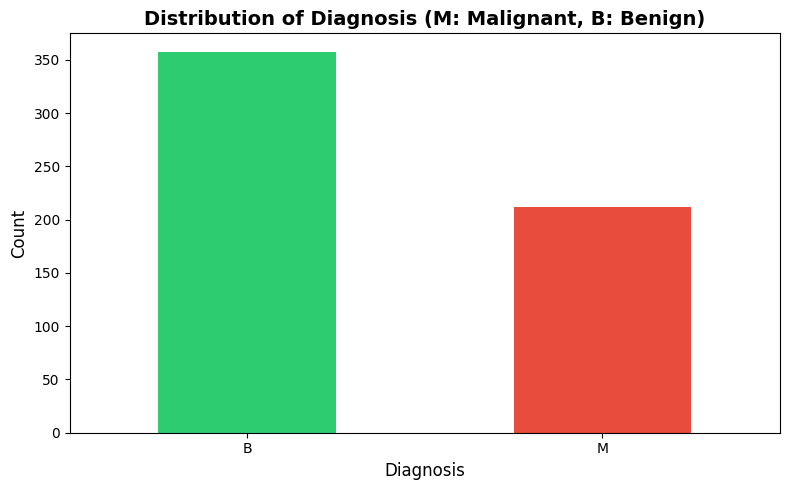
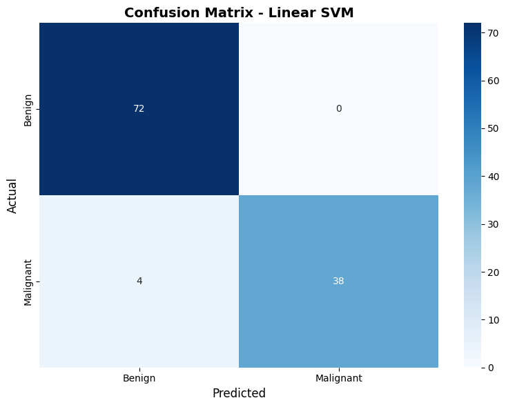
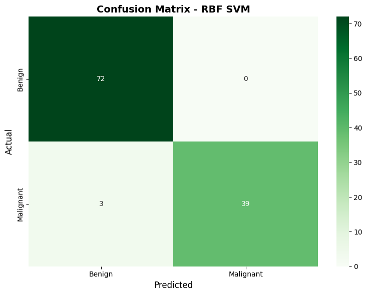
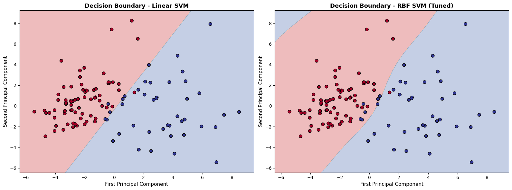
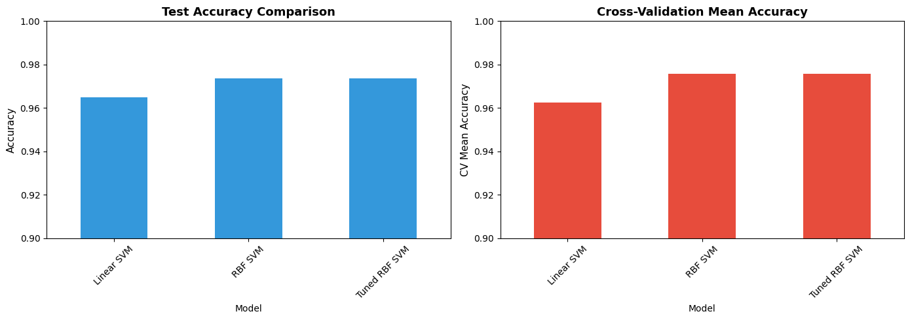

# Support Vector Machines (SVM) for Breast Cancer Classification

## 📋 Overview
This project implements **Support Vector Machine (SVM)** classifiers for binary classification of breast cancer tumors as **Malignant** or **Benign** using the Wisconsin Breast Cancer dataset.

## 🎯 Objectives
- Train SVM models with **linear** and **RBF (non-linear)** kernels
- Visualize decision boundaries in 2D space
- Perform hyperparameter tuning using Grid Search
- Compare model performance using cross-validation
- Understand margin maximization and the kernel trick

## 🛠️ Tools & Libraries
- **Python 3.x**
- **Scikit-learn**: SVM implementation, model evaluation
- **NumPy & Pandas**: Data manipulation
- **Matplotlib & Seaborn**: Visualization

## 📊 Dataset
**Breast Cancer Wisconsin Dataset** with 569 samples and 30 features:
- **Features**: Mean, SE, and worst values for radius, texture, perimeter, area, smoothness, etc.
- **Target**: Diagnosis (M = Malignant, B = Benign)

## 💻 Usage

### Run in Google Colab:
1. Open the notebook in Google Colab
2. Run cells sequentially
3. Upload your dataset when prompted
4. View results and visualizations

## 📁 Project Structure
```
├── svm_breast_cancer.ipynb     # Main Colab notebook
├── README.md                   # This file
└── breast_cancer.csv           # Dataset
└── results/                       # Dataset folder
    └── distribution_diagnosis.png
    └── confusion_matrix.png
    └── confusion_matrix_2.png
    └── decision_boundary.png
    └── model_comparison.png

```

## 🚀 Implementation Steps

### 1. Data Loading & Exploration
- Upload CSV from local storage in Google Colab
- Check for missing values and data distribution
- Visualize class balance

### 2. Data Preprocessing
- Separate features and target variable
- Encode target: M=1 (Malignant), B=0 (Benign)
- Split data: 80% training, 20% testing
- **Feature scaling** using StandardScaler (critical for SVM!)

### 3. Linear SVM
- Train SVM with linear kernel
- Evaluate using accuracy, confusion matrix, and classification report
- Perform 5-fold cross-validation

### 4. RBF SVM (Non-linear)
- Train SVM with Radial Basis Function kernel
- Compare performance with linear SVM
- Understand the kernel trick

### 5. Hyperparameter Tuning
- Use **GridSearchCV** to find optimal C and gamma
- Parameters tested:
  - C: [0.1, 1, 10, 100]
  - gamma: ['scale', 'auto', 0.001, 0.01, 0.1, 1]
- Select best model based on cross-validation score

### 6. Decision Boundary Visualization
- Apply **PCA** to reduce to 2D
- Plot decision boundaries for linear and RBF kernels
- Visualize how different kernels separate classes

### 7. Model Comparison
- Compare accuracy across all models
- Analyze cross-validation scores
- Generate comprehensive performance reports

## 📊 Generated Visualizations

1. Distribution of Diagnosis

   
   
3. Confusion Matrix
   
   
      
5. Decision Boundary
   
   
7. Model Comparison
   
   

## 📈 Results
| Model | Test Accuracy | CV Mean |
|-------|---------------|---------|
| Linear SVM | ~96-97% | ~96% |
| RBF SVM | ~97-98% | ~97% |
| Tuned RBF SVM | **~98-99%** | **~98%** |

## 🧠 Key Concepts Learned

### 1. Margin Maximization
- SVM finds the hyperplane that maximizes the distance (margin) between classes
- Support vectors define the decision boundary

### 2. Kernel Trick
- Transforms data into higher dimensions without explicit computation
- Linear kernel: Best for linearly separable data
- RBF kernel: Handles complex, non-linear patterns

### 3. Hyperparameter Tuning
- **C (Regularization)**: Trade-off between margin width and misclassification
  - Small C → Wider margin, more errors (underfitting)
  - Large C → Narrow margin, fewer errors (overfitting)
- **Gamma (RBF)**: Influence range of single training sample
  - Small gamma → Far reach, smoother boundary
  - Large gamma → Close reach, complex boundary

### 4. Feature Scaling
- Essential for distance-based algorithms like SVM
- Ensures all features contribute equally

## 📝 Notes
- Feature scaling is **critical** for SVM performance
- RBF kernel generally outperforms linear kernel on this dataset
- Hyperparameter tuning significantly improves accuracy
- Cross-validation provides robust performance estimates

