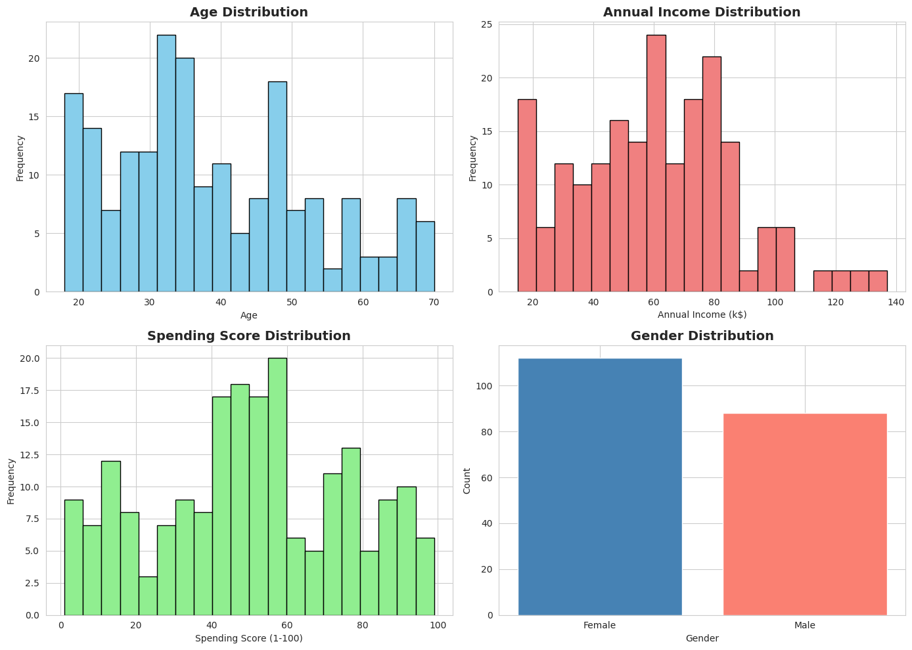
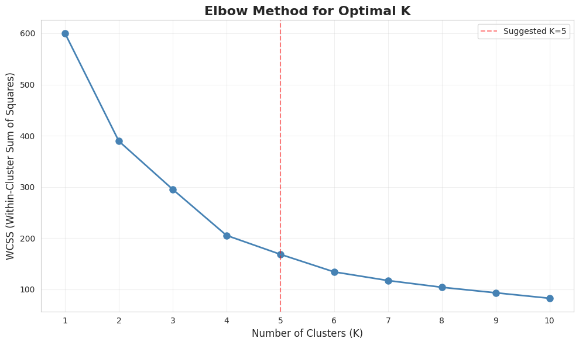
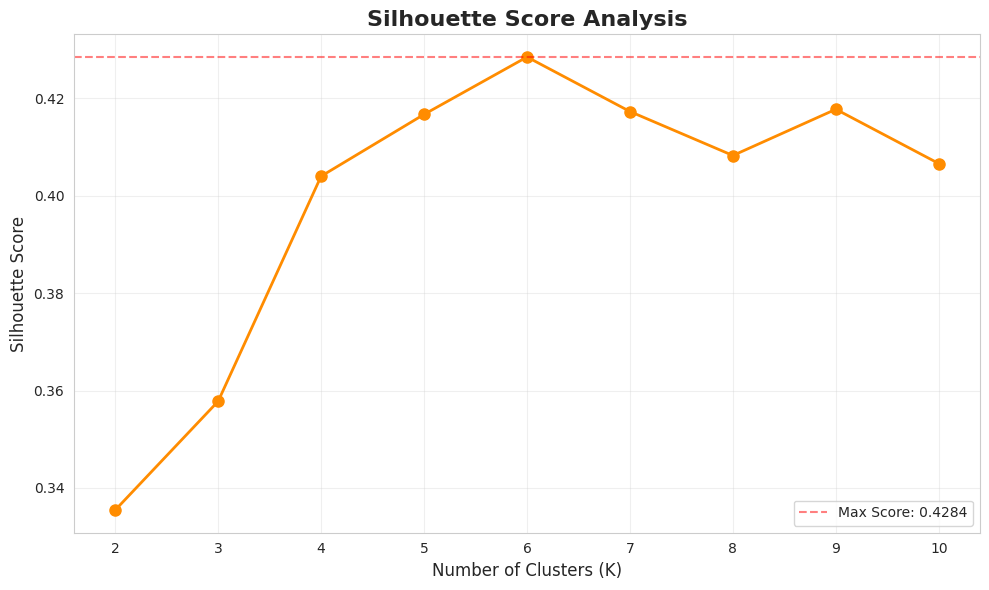
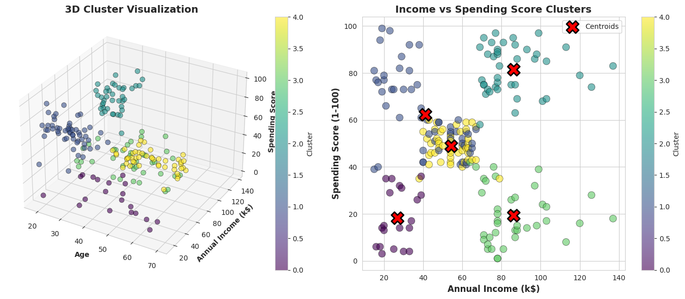
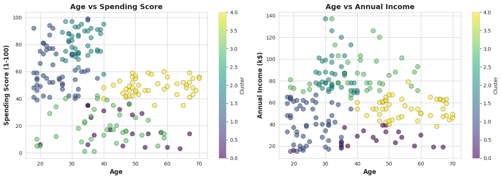
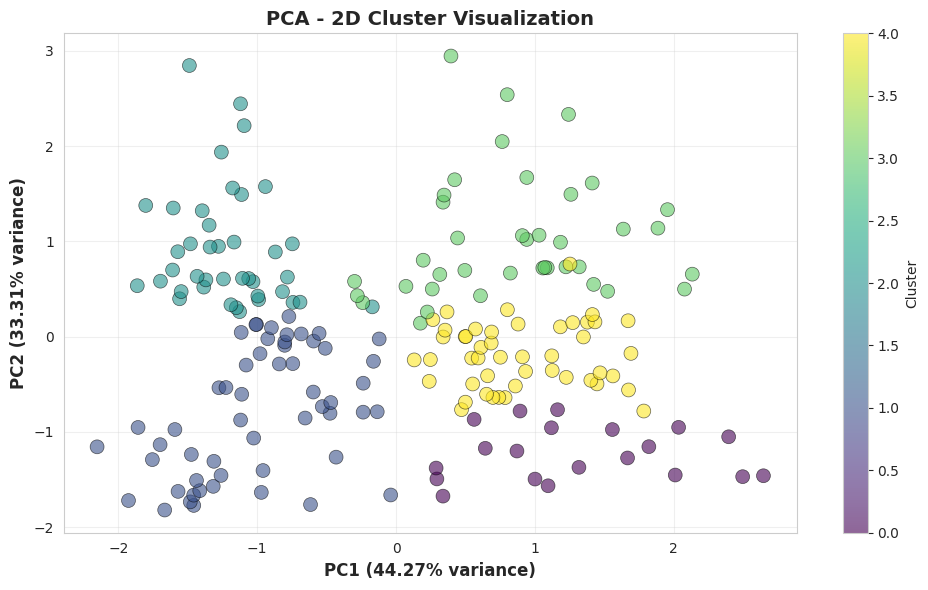

# K-Means Clustering - Mall Customer Segmentation

## 📋 Project Overview

This project implements unsupervised learning using K-Means clustering to segment mall customers based on their demographics and spending behavior. The goal is to identify distinct customer groups to help businesses develop targeted marketing strategies.

## 🎯 Objectives

- Perform customer segmentation using K-Means clustering
- Determine the optimal number of clusters using the Elbow Method
- Evaluate clustering quality using Silhouette Score
- Visualize customer segments in 2D and 3D space
- Profile each cluster for business insights

## 📊 Dataset

**Dataset**: Mall Customer Segmentation Data  
**Features**:
- CustomerID: Unique identifier for each customer
- Gender: Male/Female
- Age: Customer age in years
- Annual Income (k$): Annual income in thousands of dollars
- Spending Score (1-100): Score assigned by the mall (1=lowest, 100=highest)

**Size**: 200 entries

## 🛠️ Technologies Used

- **Python 3.x**
- **Pandas**: Data manipulation and analysis
- **NumPy**: Numerical computations
- **Scikit-learn**: K-Means algorithm and evaluation metrics
- **Matplotlib**: Data visualization
- **Seaborn**: Statistical visualizations

## 🚀 Usage

### Google Colab

1. Open the notebook in Google Colab
2. Run all cells sequentially
3. When prompted, upload your CSV dataset file
4. View the analysis results and visualizations

## 📈 Implementation Steps

### Step 1: Data Loading & Exploration
- Upload dataset from local storage
- Display dataset structure and statistics
- Visualize feature distributions

### Step 2: Data Preprocessing
- Select relevant features (Age, Annual Income, Spending Score)
- Standardize features using StandardScaler
- Prepare data for clustering

### Step 3: Elbow Method
- Calculate WCSS for K values from 1 to 10
- Plot Elbow curve to identify optimal K
- Determine the "elbow point"

### Step 4: Silhouette Analysis
- Compute Silhouette scores for different K values
- Identify the K with highest Silhouette score
- Validate optimal cluster count

### Step 5: K-Means Clustering
- Apply K-Means with optimal K (typically 5)
- Assign cluster labels to customers
- Calculate cluster centers

### Step 6: Visualization
- 3D scatter plot (Age, Income, Spending Score)
- 2D visualizations of feature pairs
- PCA-based 2D representation
- Color-coded cluster segments

### Step 7: Cluster Profiling
- Analyze average characteristics of each cluster
- Interpret business meaning of segments
- Provide actionable insights

## 📊 Key Metrics

- **WCSS (Within-Cluster Sum of Squares)**: Measures cluster compactness
- **Silhouette Score**: Ranges from -1 to 1 (higher is better)
  - Score > 0.5: Good clustering
  - Score > 0.7: Strong clustering

## 🎯 Expected Clusters

The typical customer segments identified:

1. **Premium Customers**: High income, high spending
2. **Impulsive Buyers**: Low income, high spending
3. **Conservative Spenders**: High income, low spending
4. **Budget-Conscious**: Low income, low spending
5. **Average Customers**: Moderate income and spending

## 📷 Visualizations

The project generates:
- Feature distribution histograms
  
- Elbow curve for optimal K
  
- Silhouette score plot
  
- 3D cluster visualization
  
- 2D scatter plots with cluster colors
  
- PCA-based dimensionality reduction plot
  

## 🧠 What You'll Learn

- **Unsupervised Learning**: Clustering without labeled data
- **K-Means Algorithm**: How it works and when to use it
- **Feature Scaling**: Importance of standardization
- **Cluster Evaluation**: Using WCSS and Silhouette scores
- **Data Visualization**: Representing high-dimensional data
- **Business Interpretation**: Translating clusters into insights

## 📝 Results Interpretation

After running the analysis:
1. Check the Elbow curve for the optimal K
2. Verify with Silhouette score
3. Examine cluster visualizations
4. Review cluster profiles
5. Apply business insights for marketing strategies

## 🤝 Contributing

Contributions are welcome! Please feel free to submit issues or pull requests.

## 🔗 Resources

- [Scikit-learn K-Means Documentation](https://scikit-learn.org/stable/modules/generated/sklearn.cluster.KMeans.html)
- [K-Means Clustering Theory](https://en.wikipedia.org/wiki/K-means_clustering)
- [Silhouette Score Explanation](https://scikit-learn.org/stable/modules/generated/sklearn.metrics.silhouette_score.html)

---

**Note**: Make sure your dataset follows the same structure as described above for the code to work properly.